# Installing Arch Linux on vmware-fusion

### 1. Step One: Install the ISO file.
1. GoTo <a href="https://archlinux.org/">Archinux</a> website and download the ISO
2. check the Validation with sha256

### 2. Step Two: Setup the VM in VmWare.
1. GoTo New and create new Virtual Machine.


1. Click the <B><i>Install from disc or image</i></B>
2. Choose or drag your disc image.


1. Click continue.
2. Choose <B><i>Other Linux 5.x kernel 64-bit</i></B>


1. Click continue.
2. Select <B><i>Legacy BIOS</i></B>


1. Click continue.
2. And then Hit Finish.


### 3. Boot In To the Vm.
1. Click <B><i>Arch Linux Install Medium (x86_64, BIOS)</i></B>


### 4. Step Three: Setup The Time
- ``` timedatectl set-ntp true ``` 


### 5. Step Five: Partitioning.
1. See the what Disk do you have ``` fdisk -l ``` 


2. Partition the <B><i>``` /dev/sda ```</i></B>
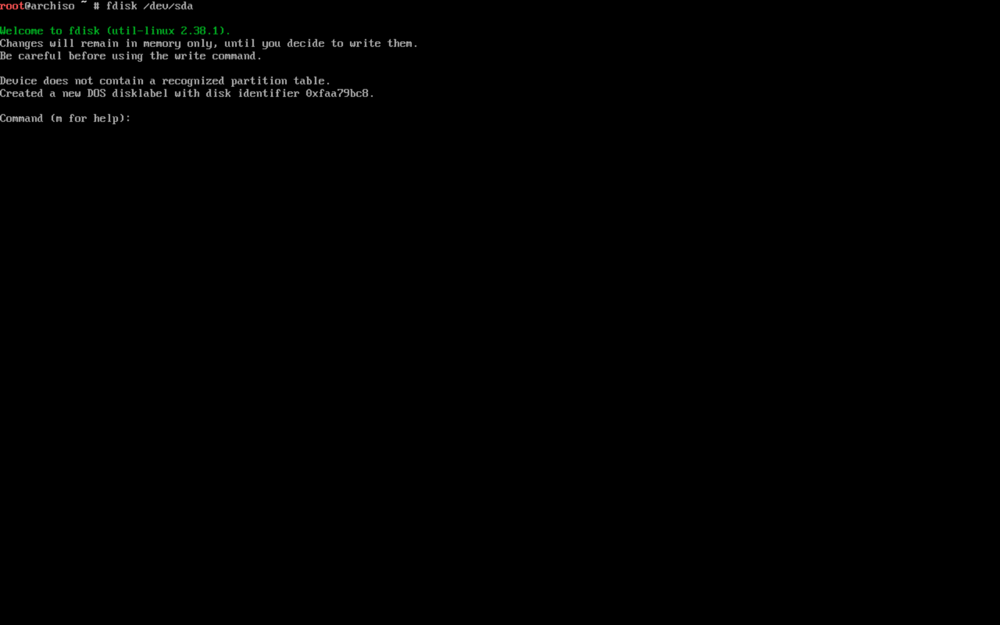

3. Write ``` n ``` for new patition
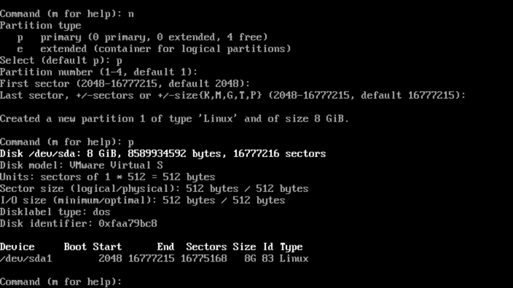

4. Write ``` w ``` for Write & quit


5. Format the Partiition: ``` mkfs.ext4 /dev/sda1 ```
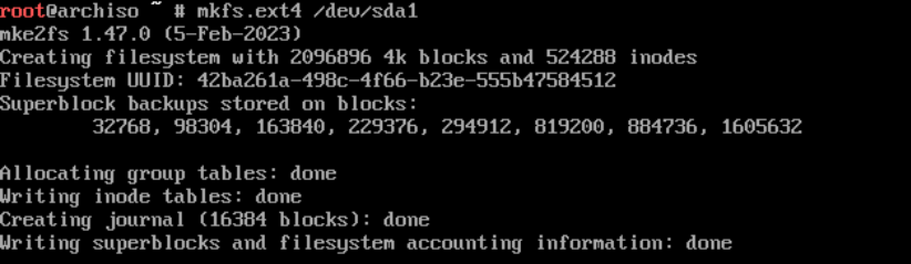

6. Mount The Partition: ``` mount /dev/sda1 /mnt ```


### 6. Step Six: Installing Arch Linux.

1. Install The Base of the OS
- ``` pacstrap /mnt base base-devel linux linux-firmware vim ```
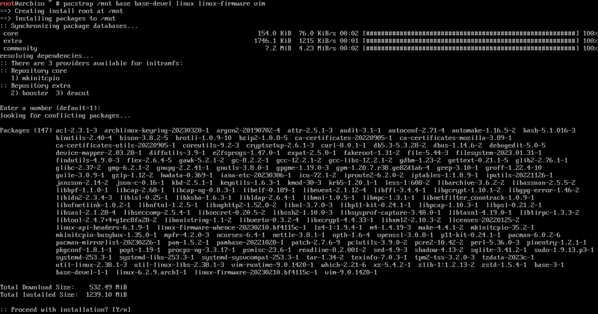

### 7. Step Seven: FSTab Configuration.

- ``` genfstab -U /mnt >> /mnt/etc/fstab ```
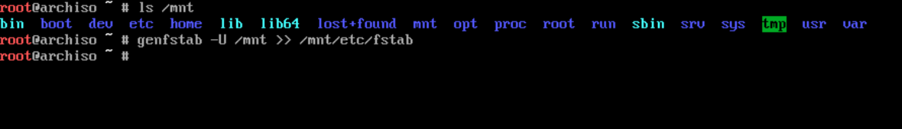

### 8. Step Eight: Chroot into our arch linux.

- ``` arch-chroot /mnt /bin/bash ```

### 9. Step Nine: Install NetworkManager and Grub.

- ``` pacman -S networkmanager grub ```
- enable NetworkManager in systemd ``` systemctl  ```
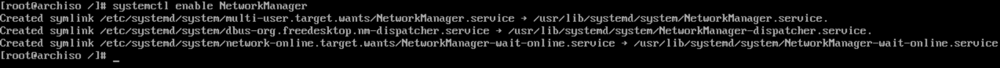
> Make sure you've spell it correctlly and Notis the capitalize. 

### 10. Step Ten: Configure The Grub.

1. install Grub on <B><i>``` /dev/sda ```</i></B>
    - ``` grub-install /dev/sda ```
    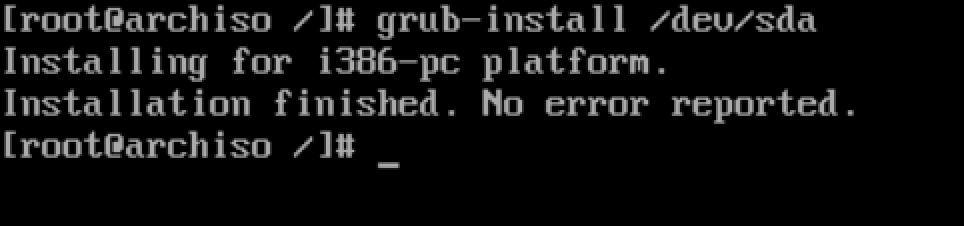

2. Generate Configuration File.
    - ``` gurb-mkconfig -o /boot/grub/grub.cfg ```
    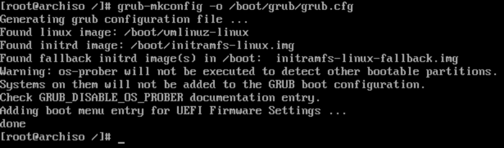


### 11. Step Eleven: Set a PassWord For root User.
- ``` passwd ```

### 12. Step Twelve: Generate Locale.

- ``` vim /etc/locale.gen ```
- UnCommnet The en_US lines
    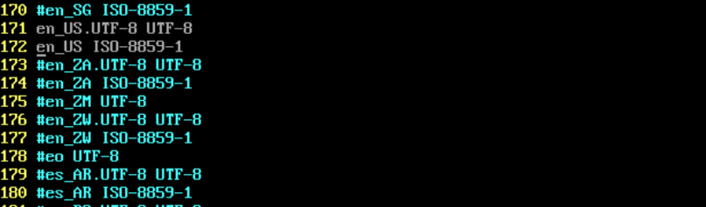

- Then Generate Locale: ``` locale-gen ```
    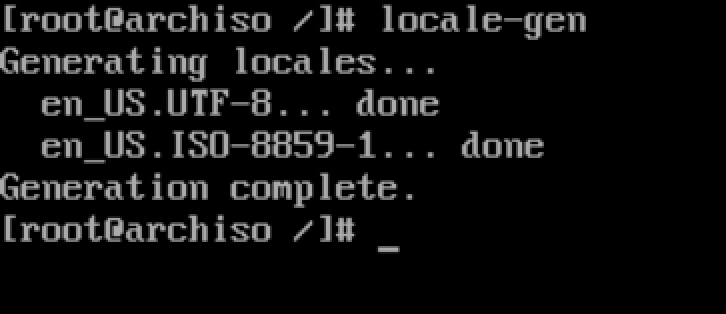

- Define Language in <B><i>``` locale.conf ```</i></B>
    - ``` vim /etc/locale.conf ```
        - ``` LANG=en-US.UTF-8 ```
        

- Setup The HostName: 
    - ``` vim /etc/hostname ```


- Link TimeZone: ``` ln -sf /usr/share/zoneinfo/Asia/Tehram /etc/localtime ```
    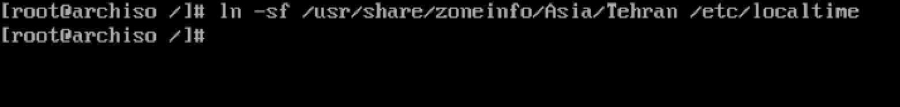

### 13. Step Thirteen: Done The Installation.

> Exit out the chroot Environment:

1. ``` exit ``` in chroot
2. ``` umoumt -R /mnt ```
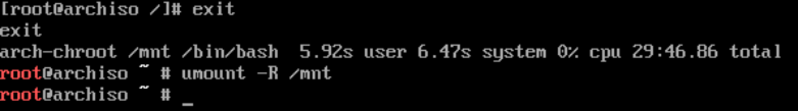


3. Reboot The system: <B><i>``` rebbot ```</i></B>

### 💥 Boom 
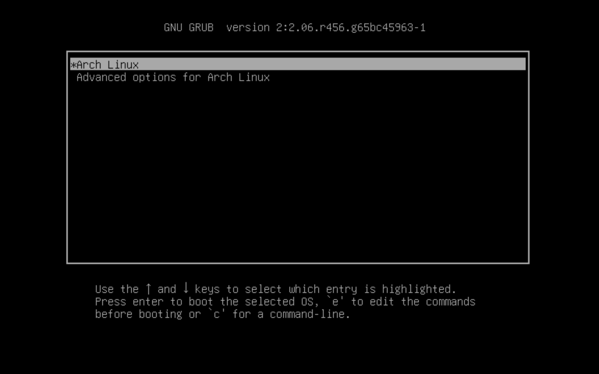


